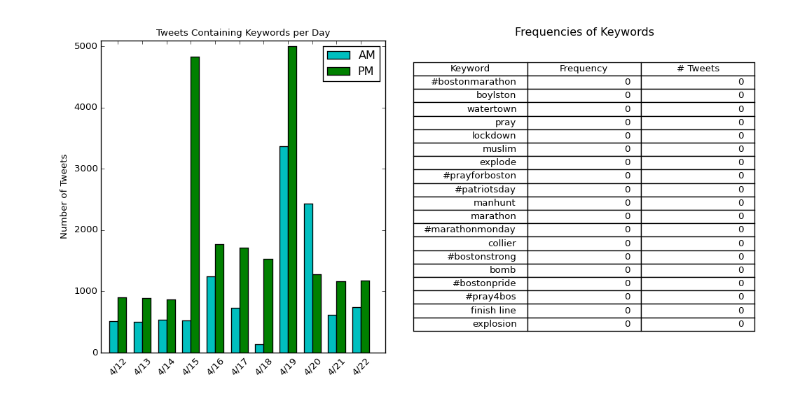
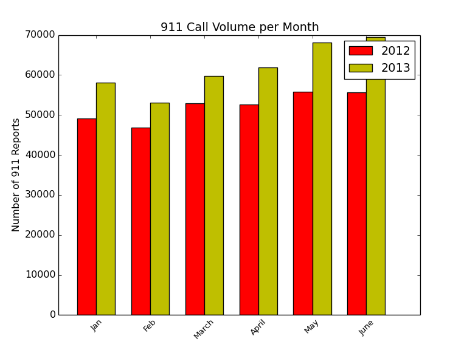

### Brooks E., Fuss H., McKenzie J.
### TRiCAM - BARI
### Work Statement
### June 19, 2015
  

#####Problem Statement
The research question we are working on, proposed by the Boston Area Research Initiative, is focused on the Boston Marathon bombing in 2013. This is a multi-faceted project with several detailed data sets to analyze. The data sets include records of 911 reports from January to June of 2012 and 2013, 311 reports from the years 2010 to 2014, and “cleaned” geo-tagged tweets from April 12th through 22nd of 2013. There is also Twitter data for a greater period of time and area that has not yet processed. From this rather large pool of data arises several important, primary goals.  
The first goal of our research is to track the patterns of information dissemination throughout the city and its neighborhoods via geo-tagged Twitter data. Secondly, it will be necessary to develop and visualize the flow of sentiments and emotion throughout the city of Boston. Next, the patterns of crime and disorder throughout the city will be modeled in order to determine how the behavior of the public may have changed during the time of the crisis. This will allow for a better understanding of constituent behavior throughout the city’s various neighborhoods and districts during the state of emergency, after the bombing. Thus, correlations between the public’s reactions and socioeconomic conditions may be patterned and visualized.  
These goals will be accomplished through the detailed analysis of the given data sets. From the geo-tagged Tweets, we will be able to observe whether or not the sentiments and information disseminated by the public move along predictable geographical pathways, or if the data exhibits a less predictable pattern. One limitation of this analysis will be the fact that the geo-tagged tweets only account for a small percentage of all the tweets that were posted around the time of the events. In order to represent these movements, we plan to create either time-lapse or animated plots of this flow and overlay it on a map of the city of Boston.   
Next, in order to track the patterns of crime and disorder throughout the city, we will determine how these behaviors may have changed during the time of the crisis. In order to do this, we will compare the amount of violent and petty crimes, as well as medical emergencies reported during the week of and before the bombing and manhunt. Additionally, we will study the density of these reports with respect to their geographic location to better observe the city’s neighborhood dynamics. The data from the week of the bombing 2012, the previous year, will be used as a control. Similarly, we will analyze and compare the 311 data using public and private classification.

#####Initial Work
Over the past week, we have started to process the data through the use of programs that parse the data sets and conduct basic analysis. This will allow us to add more and more functionality as we progress through the research. Additionally, we have also begun to establish criteria for the analysis of the data sets. This includes determining which latents characterize a 911 report under violent, petty, or medical. Then we determined which latents classify a 311 report as public or private. 
Next, we developed a dictionary of keywords that can accurately determine if a tweet was referring to the bombing and/or manhunt. As we analyze smaller and smaller units of time, it will be necessary to reference the data against a timeline of major events related to the bombing. Lastly, we have begun to familiarize ourselves with natural language processing, sentiment analysis, and basic machine learning. This will allow us to develop a program that will determine the sentiment of a given tweet with reasonable accuracy.
Using the initial keyword dictionary we have written, it was possible to count the volume of related geo-tagged tweets in the morning (AM) and evening (PM) for a ten day period, April 12th through 22nd of 2013, during which the bombings and manhunt took place (Figure 1). Additionally, we have counted the number of times each of the classified keywords occurred. This will allow us to tweak the keyword dictionary throughout the duration of the research process (Figure 1). With the current dictionary, we have observed spikes at the periods of time when significant events occurred. This indicates our dictionary is reasonably accurate, at this point.  

	

**Figure 1.**  The density of tweets during the week of the Boston Marathon (2013) bombing containing the pre classified keywords listed to the right of the figure.

  For the data set containing 911 reports from January to June of 2012 and 2013, we have plotted the frequency of reports for each month against the two years (Figure 2). This allows us to track the differences between other months and the month of April, when the bombings took place. However, from the current plot it is difficult to observe any significant trends, aside from the fact that 911 reports increased from 2012 to 2013. It also appears that the volume of reports increase more rapidly as the year of 2013 progressed (Figure 2).

	

**Figure 2.** The volume of 911 reports for the months of January through June 2012 and 2013

  A program has also been which to count the number of 911 reports that have a bomb related code or description. Then we observed that in 2012 that there were 101 bomb related reports, while the year 2013 presented 432, a significant increase that may be attributed to the bombing incident. Finally, for the data set containing 311 reports, we have extracted the reports from the years of 2012 and 2013. This is to remain consistent with our current 911 analysis.
  
#####Timeline of Future Work
- **Week 1:**
Understand sentiment analysis and machine learning techniques necessary for the processing of the Twitter data.
- **Week 2:**
Decide on a technique for the training and visualization of data for each of the given data sets.
- **Week 3:**
Determine individual tasks and proceed to analyze the data.
- **Week 4:**
Work on issues and program debugging. Also, consider methods of data interpretation for future analysis.

#####Division of Labor
  In order to achieve our proposed goals, we have separated the research into four parts. Firstly, the 911 and 311 data sets will be pre processed by Jeremy, with particular attention being paid to latents indicating petty and violent crimes in addition to public versus private issues. Then the trained 911 and 311 data sets will be visualized by Jeremy and Hayden, who will also provide supplemental analysis and algorithm development support.  
Finally, Hayden will classify a labeled dictionary that will then be implemented by Elizabeth for the analysis of the Twitter data for sentiment. This will be achieved through the use of complex machine learning algorithms, such as naive bayes classification, and the advanced scripting language Python.

#####Potential Issues
  Obstacles related to the analysis of sentiment within the Twitter data will be spelling errors made by an individual while tweeting, as well as the processing of negation words like “not”. However, it will also be possible for us to simply handle the issue of spelling errors through the use of symmetric deletion. Negations will be handled simply within a string tokenizer. The data passed to the tokenizer will be trained by Hayden and the tokenizer will be developed by Elizabeth.

#####Research Summary
  In conclusion, we plan to track the patterns of information dissemination as well as the flow of sentiments throughout the city and its neighborhoods via geo-tagged Twitter data. Then we will visualize the patterns of crime and disorder throughout the city during the time of the Boston Marathon 2013 bombing using the 911 and 311 report data sets. Finally, it will be possible to determine if there is a correlation between the public’s reactions and socioeconomic conditions.
